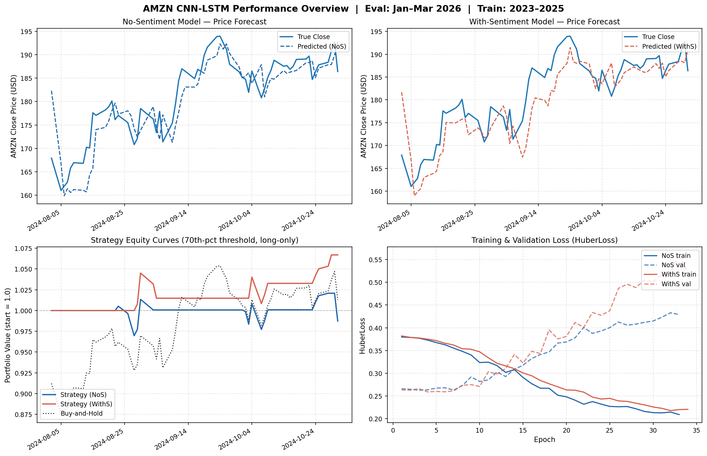

# Crimson Quant System

A stock price prediction system that combines a CNN-LSTM deep learning model with optional
news sentiment analysis to generate daily BUY/HOLD or SELL/CASH trading signals. The model
is trained on historical OHLCV data and 26 technical indicators, with an optional 27th feature
derived from VADER sentiment scores on Alpha Vantage news articles. Signals are produced by
comparing the model's next-day log-return forecast against a quantile threshold calibrated on
a held-out back-test period.

## Features

- CNN-LSTM architecture: two Conv1d layers feed into a 2-layer LSTM with a dense regression head
- 26 technical indicators computed automatically from raw OHLCV data (SMA, EMA, RSI, MACD, momentum, volatility)
- Optional VADER news sentiment as a 27th input feature, fetched from Alpha Vantage
- Quantile-based long-only trading strategy with configurable threshold
- Parallel no-sentiment and with-sentiment experiments trained and evaluated in a single run
- Historical back-test against real close prices with equity-curve and forecast plots
- Daily live signal mode: fetches today's data, runs inference, prints signal for the next trading day

## How It Works

The model (`CNNLSTMRegressor`) applies two Conv1d layers (64 channels, kernel size 5) followed
by batch normalization and ReLU activations to extract local patterns from a 60-day sliding
window of feature vectors. The output is passed through a 2-layer LSTM (96 hidden units) to
capture sequential dependencies, then through a dense head (Linear → ReLU → Dropout(0.2) →
Linear) that produces a single next-day log-return forecast. Training uses HuberLoss with AdamW
and early stopping on validation loss.

The feature set covers five categories: raw OHLCV, price and volume derivatives (log return,
high-low spread, open-close change, gap), moving averages (SMA 5/10/20/50, EMA 12/26),
momentum indicators (3-day, 5-day, 10-day momentum, RSI-14), and volatility (5-day, 10-day
rolling std). When sentiment is enabled, a daily VADER compound score is appended as a 27th
feature, aligned by date to the OHLCV series.

The trading strategy converts the model's continuous log-return forecast into a binary signal.
After a back-test run, the system computes the `quantile_level` percentile of forecast values
on the held-out period and uses that value as the long-entry threshold: forecasts above the
threshold generate a BUY signal for the next day; all others produce HOLD or SELL/CASH. The
threshold is stored in `eval_outputs/{tag}/eval_predictions.csv` and read automatically by
`predict.py` at runtime.

## Results

The following results are for **AMZN**, evaluated over **64 trading days (2024-08-02 to 2024-10-31)**,
using models trained on January 2023 – July 2024 data.



### Metrics Comparison (AMZN, Aug–Oct 2024)

| Metric | No-Sentiment | With-Sentiment |
|---|---|---|
| MAE (USD) | **3.330** | 3.738 |
| RMSE (USD) | **4.282** | 4.744 |
| MAPE | **1.87%** | 2.07% |
| R² | **0.748** | 0.690 |
| Directional Accuracy | 43.75% | **51.56%** |
| Up Precision | 52.94% | **75.00%** |
| Strategy Return | −1.27% | **+6.69%** |
| Buy-and-Hold Return | +1.27% | +1.27% |
| Excess Return | −2.53% | **+5.43%** |
| Sharpe Ratio | −0.273 | **2.103** |
| Max Drawdown | −3.57% | −3.52% |
| Win Rate | 52.94% | **75.00%** |
| Trade Count | 17 | **12** |
| Exposure | 26.56% | **18.75%** |

> **Key finding — regression vs. trading paradox:** The no-sentiment model has *better* price-level
> accuracy (lower MAE/RMSE, higher R²), while the sentiment model has *worse* regression but
> dramatically better trading outcomes. Adding sentiment raises RMSE from 4.28 to 4.74 and drops
> R² from 0.748 to 0.690 — yet the sentiment strategy returns +6.69% vs −1.27%, with a Sharpe of
> 2.10 vs −0.27. The mechanism: sentiment improves directional precision on up-moves (75% vs 53%
> up-precision), enabling fewer but higher-conviction entries (12 trades, 18.75% exposure) versus
> the no-sentiment model's 17 lower-quality trades. During a moderate bull market (AMZN +1.27%
> buy-and-hold), selective entry was rewarded with +5.43% excess return.

## Prerequisites

- Python 3.10 or later
- pip
- An Alpha Vantage API key (`NEWSAPI_KEY`) — required only for the news sentiment pipeline;
  price data is fetched from Yahoo Finance via yfinance and requires no key

## Quick Start

```bash
# 1. Install dependencies
pip install -r requirements.txt

# 2. Set API key (required for sentiment; skip if using no-sentiment model only)
cp .env.example .env          # then open .env and set NEWSAPI_KEY=your_actual_api_key

# 3. Verify installation (all 106 tests should pass)
pytest tests/

# 4. Configure ticker and date range
python -m crimson_quant.config --config

# 5. Train both experiments
python train.py

# 6. Back-test and calibrate threshold
python prediction_validation.py

# 7. Generate tomorrow's signal
python predict.py
```

## Workflow

### One-time setup

1. **Configure** — set ticker, dates, quantile level, lookback window, epochs, and patience
   via `python -m crimson_quant.config --config` or edit `config.json`
2. **Fetch news** (optional, for `with_sentiment` model) — `python -m crimson_quant.fetch_news`
   pulls articles from Alpha Vantage; requires `NEWSAPI_KEY`
3. **Train** — `train.py` fetches OHLCV automatically, scores sentiment, and trains both
   `no_sentiment` and `with_sentiment` checkpoints
4. **Back-test** — `prediction_validation.py` evaluates both models on held-out historical
   dates and writes `eval_outputs/{tag}/eval_predictions.csv`; `predict.py` reads this file
   to calibrate its signal threshold

> **Note:** Step 4 is required before running `predict.py` for a meaningful threshold. Without
> it, the threshold falls back to `0.0` (any positive prediction → BUY). The threshold has a
> minimum floor of `0.001` (0.1% daily log return) to prevent degenerate zero-threshold signals.

### Daily (post-market-close)

5. **Live signal** — `predict.py` fetches today's OHLCV and news, runs inference, and prints
   a BUY/HOLD or SELL/CASH signal for the next trading day

## Commands

```bash
# Install dependencies
pip install -r requirements.txt

# Configure ticker, date range, quantile level, lookback window, epochs, and early-stopping patience (interactive or view current)
python -m crimson_quant.config --config
python -m crimson_quant.config --show

# Train (reads ticker and date range from config.json)
# To change ticker or date range, run: python -m crimson_quant.config --config
python train.py

# Back-test both models on held-out historical data (end date must be ≤ today)
# Outputs to eval_outputs/no_sentiment/ and eval_outputs/with_sentiment/
python prediction_validation.py                          # defaults to 1 month after training end
python prediction_validation.py --range 30d              # 30 days from training end
python prediction_validation.py --range 4w               # 4 weeks from training end
python prediction_validation.py --range 3m               # 3 months from training end
python prediction_validation.py --range 2024-06-15       # up to a specific past date

# Generate next-day trading signal (run after market close each day)
python predict.py                   # uses with_sentiment checkpoint
python predict.py --no-sentiment    # uses no_sentiment checkpoint

# Fetch news from Alpha Vantage (requires NEWSAPI_KEY)
python -m crimson_quant.fetch_news --ticker AAPL --time-from 20190401T0000 --time-to 20221101T0000

# Score articles and build daily sentiment CSV
python -c "from sentiment_evaluation import evaluate_and_save_sentiment; evaluate_and_save_sentiment('data/AAPL_News_AlphaVantage_....csv', 'AAPL', '2019-04-01', '2022-11-01')"

# Run tests
python -m pytest tests/ -v
```

## Example Output

Running `python predict.py` after a completed back-test prints a signal block similar to:

```
Ticker:     AAPL
Date:       2024-03-18
Model:      with_sentiment
Forecast:   +0.0031  (log return)
Threshold:  +0.0018  (70th percentile from back-test)

Signal:     BUY / HOLD
```

When the forecast falls below the threshold:

```
Ticker:     AAPL
Date:       2024-03-18
Model:      with_sentiment
Forecast:   -0.0012  (log return)
Threshold:  +0.0018  (70th percentile from back-test)

Signal:     SELL / CASH
```

## Configuration

Configuration is read from `config.json`. Values not present in `config.json` fall back to the
dataclass defaults in `config.py`.

**Priority:** `config.json` > dataclass defaults in `config.py`

> **Note:** `train.py` reads from `config.json` only — use `python -m crimson_quant.config --config` to set
> ticker, dates, lookback, epochs, and patience. `prediction_validation.py` accepts `--range`
> to control the back-test window; the end date must be ≤ today since it requires real close
> prices for comparison. For a forward-looking signal use `predict.py` instead.

| Field | Type | Default | Description |
|---|---|---|---|
| `ticker` | string | `AAPL` | Stock ticker symbol |
| `start` | string | `2019-04-01` | Training period start date (YYYY-MM-DD) |
| `end` | string | `2022-11-01` | Training period end date (YYYY-MM-DD) |
| `quantile_level` | float | `0.70` | Percentile threshold for the long-only trading strategy (0 < x < 1) |
| `lookback` | int | `60` | Sliding window size in days used to build each training sample |
| `epochs` | int | `300` | Maximum training epochs |
| `patience` | int | `30` | Early-stopping patience (epochs without val-loss improvement before stopping) |

## Project Structure

```
Crimson-Qunat-System-Stock-ML/
│
│  # CLI entry points (run from project root)
├── train.py                     Training entry point — training loop, early stopping, prediction helpers
├── predict.py                   Daily live signal — BUY/HOLD or SELL/CASH for tomorrow
├── prediction_validation.py     Historical back-test on held-out dates (end date must be ≤ today)
│
│  # Installable library package
├── crimson_quant/
│   ├── __init__.py
│   ├── config.py                Configuration dataclass, CLI config tool, feature list
│   ├── model.py                 CNNLSTMRegressor (Conv1d → LSTM → Dense)
│   ├── data_loader.py           Windowed dataset, scaler, train/val/test split
│   ├── features.py              Technical indicator computation, sentiment loader
│   ├── stock_data_fetcher.py    Yahoo Finance OHLCV fetcher via yfinance
│   ├── fetch_news.py            News fetching from Alpha Vantage API (pagination, chunked date ranges)
│   ├── sentiment_evaluation.py  VADER sentiment scoring, daily aggregation, training/prediction CSV output
│   ├── metrics.py               Price, direction, and trading strategy metrics
│   └── plotting.py              Forecast, equity curve, and loss plots
│
│  # Configuration
├── config.json                  Persistent overrides (ticker, start, end, quantile_level, lookback, epochs, patience)
├── pyproject.toml               Package metadata and build configuration
│
│  # Tests
├── tests/
│   ├── test_config.py
│   ├── test_data_loader.py
│   ├── test_features.py
│   ├── test_fetch_news.py
│   ├── test_metrics.py
│   ├── test_model.py
│   ├── test_prediction_validation.py
│   ├── test_sentiment_evaluation.py
│   └── test_stock_data_fetcher.py
│
│  # Generated / output directories
├── checkpoints/                 Saved model weights (.pt)
├── data/                        Raw CSVs, sentiment scores, news articles
├── eval_outputs/                Evaluation results on held-out period
└── training_outputs/           Training metrics and history per experiment
```

## Environment Variables

1. Copy `.env.example` to `.env`:
   ```bash
   cp .env.example .env
   ```
2. Open `.env` and set your Alpha Vantage API key:
   ```
   NEWSAPI_KEY=your_actual_api_key
   ```

> `.env` is git-ignored and will not be pushed to the repository.
